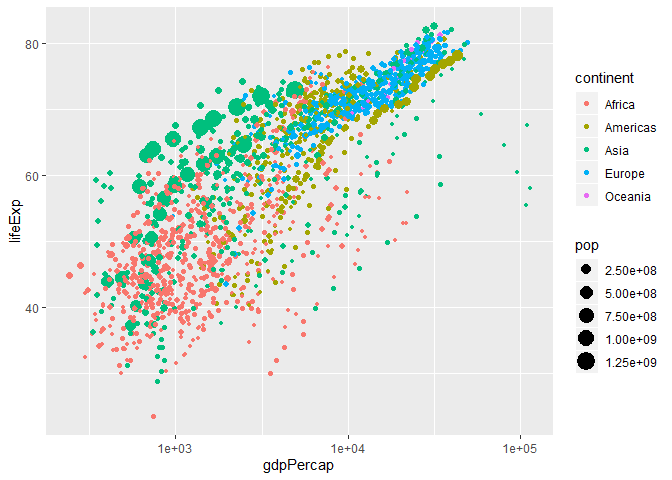

Recreating Gapminder
================

This document: [bit.ly/mia-dataviz-doc](http://bit.ly/mia-dataviz-doc)

#### Objectives

  - Identify important graphical elements in data visualizations
  - Explain a graphical element’s conventional use for a specific
    representation
  - Relate graphical elements’ representation and its contextual meaning
  - (Re)Create a data visualization using the `ggplot2` package in R

## Gapminder

Hans Rosling was an engaging public speaker and spent much of his later
years focusing on worldwide healthcare. He, his son, and his
daughter-in-law co-founded the Gapminder Foundation to convert
international statistics into interactive graphics to help visualize
world development
[wikipedia.org/Hans\_Rosling](https://en.wikipedia.org/wiki/Hans_Rosling#Trendalyzer_and_Gapminder).

[](https://youtu.be/jbkSRLYSojo?t=29)

  - What variables were being presented in this visualization?

  - How were each of these variables being represented?

## A layered graphical framework

A graphical representation of data is going to be comprised of at least
three features:

1.  **Data** that we want to visualize,
2.  A set of **mapping**s describing how variables in the data are
    assigned to aesthetic attributes, and
3.  **Geom**etric objects representing what we actually see on the plot
    (e.g., points, lines, polygons).

When we are creating data visualizations in R using the `ggplot2`
package, we should keep these layers in mind:

data + mapping + geometric objects

### RStudio Cloud

Join my RStudio Cloud **Math in Action - Data Visualizations in R**
Workspace:
[bit.ly/mia-dataviz-rstudio](http://bit.ly/mia-dataviz-rstudio)

  - You will be asked to create a free account.
  - Once signed in, verify that you can a Project called
    `recreating-gapminder`.
  - Click on it to start your RStudio session.

## Data visualization

### The data

The amazing [Jenny Bryan](https://jennybryan.org/) packaged an excerpt
of the data used in Hans’ video of five year increments from 1952 to
2007. We will use this data to do our best at emmulating Hans.

Before we get started, let’s explore the data to see what is available
to us. In the `recreating-gapminder.R` script (upper left-hand pane of
RStudio) I have provided some starter code:

``` r
#Loading needed packages
library(tidyverse)
library(gapminder)
library(gganimate)

# View the data
?gapminder
gapminder

...
```

  - Highlight lines 2 -4 of the R script and press Ctrl + Enter.
  - Put your cursor on line 7 (or highlight the entire line) and press
    Ctrl + Enter (or Cmd + Return) on your keyboard. Information should
    have displayed in the **Help** pane (lower right-hand pane).
  - Put your cursor on line 8 and press Ctrl + Enter. Information should
    have displayed in the **Console** pane (lower left-hand pane).

Using the infromation provide in these two panes, answer the following
questions:

Q. How many observations are in the dataset?

Q. How many variables are in the dataset?

Q. What type (i.e., quantitative or qualitative) is each variable?

### Building the visualization

Remember that we are layering elements together using “data + mapping +
geometric objects”. In `ggplot2` we use this framework to create data
visualizations.

  - Under the `# Build gapminder visualization` header in your R script,
    type the following code.

<!-- end list -->

``` r
ggplot(data = gapminder)
```

  - With your cursor on this line and press Ctrl + Enter.

There does not seem to be a lot to talk about here, but `ggplot2` now
understands what data we want to use and is waiting for us to specify
the next layer, **mapping**\!

  - Update your previous code to look like:

<!-- end list -->

``` r
ggplot(data = gapminder, mapping = aes(x = gdpPercap, y = lifeExp))
```

  - With your cursor on this line and press Ctrl + Enter.

Our visualization is starting to take shape\! Now we will *add* some
“ink” to our canvas.

  - Update your previous code to look like:

<!-- end list -->

``` r
ggplot(data = gapminder, mapping = aes(x = gdpPercap, y = lifeExp)) +
  geom_point()
```

  - Run this code.

Q. How would you describe the relationship between `gdpPercap` and
`lifeExp`?

That is the starting point for any graphic in `ggplot2`. First, we
specify the **data** and what variables we want to **map** to an
aesthetic feature. Then, we *add* **geometric objects**.

However, we haven’t quite made Hans’ visualization yet.

Before we start adding color and change the sizes of the points, we will
transform our x-axis:

  - Update your previous code to look like:

<!-- end list -->

``` r
ggplot(data = gapminder, mapping = aes(x = gdpPercap, y = lifeExp)) +
  geom_point() +
  scale_x_log10()
```

  - Run this code.

Q. Compare this to your previous graph (notice the navigation arrows in
the **Plots** pane). Which do you prefer? What does this second portion
of code do?

### Color

  - Update your previous code to look like:

<!-- end list -->

``` r
ggplot(data = gapminder, mapping = aes(x = gdpPercap, y = lifeExp)) +
  geom_point(mapping = aes(color = continent)) +
  scale_x_log10()
```

  - Run this code.

Notice that we put the `color` aesthetic mapping within the
`geom_point()` layer - we could have also put this in the `ggplot()`
layer. Within a layer we might want to specify mappings unique to that
layer or we can set global mappings by specifying them in the base
layer.

### Size

Hans also had the size of his bubbles represent how many people lived in
each particular country. Update your previous code so that `pop` is
mapped to the `size` of each point. Your plot should then look like:

<!-- -->

### Animating it

Q. What did Hans map to the animation feature of his bubble plot?

To do this with `ggplot2` we needed to bring in a helper package
(`gganimate`). You loaded this at the beginning of this activity, so now
we just need to specify this within our plot.

  - Update your previous code to look like:

<!-- end list -->

``` r
ggplot(data = gapminder, mapping = aes(x = gdpPercap, y = lifeExp)) +
  geom_point(mapping = aes(color = continent, size = pop)) +
  scale_x_log10() +
  transition_time(year) +
  ease_aes('linear')
```

  - Run this code.

This is going to take a while - it is creating a graph for each year,
then combining them into a gif.

## If time …

  - more with `size`
  - `alpha`
  - themes: `theme_bw()`
  - labels and titles: `labs(title = '', x = '', y = '')`
      - with animate titles: `{frame_time}`

## Additional resources

### Data visualization tools

  - [gapminder](https://www.gapminder.org/tools/)
  - [CODAP](https://codap.concord.org/)
  - [TidyBlocks](http://tidyblocks.tech/)

### R

  - [ggplot2 materials](https://ggplot2.tidyverse.org/#learning-ggplot2)
  - [RStudio Cloud Primers](https://rstudio.cloud/learn/primers)
